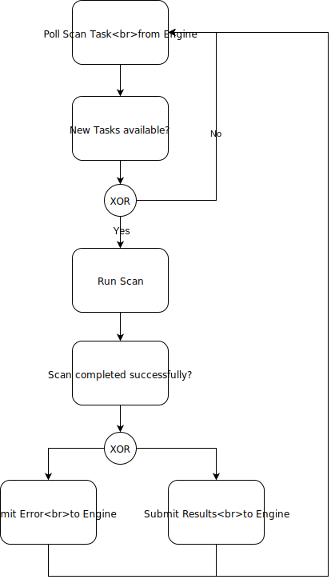

# Extending secureCodeBox

## Developing own processes

### Implementing your first scanner as a microservice

The scanner services are the part of the secureCodeBox which are executing the scans. These services have three responsibilities:

1. Fetch scan tasks and their configuration from the secureCodeBox Engine. This is done via the Rest API of the engine.
2. Run the scan. This can be done in multiple different variants like running shell scripts, calling a programmatic API, RPC, Rest APIs etc.
3. Submit scan results back to the secureCodeBox Engine.

The entire functionality of a scanner is summed up in the following flow diagram:



You can implement your scanner microservice in any language you choose. We implemented our scanners using Java, JavaScript (NodeJS) and Ruby. If you choose to use NodeJS we published an [npm package](https://www.npmjs.com/package/@securecodebox/scanner-scaffolding) which handles the communication with the engine.

### Using the Scan Job Api

The secureCodeBox Scan Job API is used to fetch new tasks from the engine.

You can find a static api documentation [here](./api/overview.md).
But the API is also documented using Swagger. You can check this out by running the engine and navigate to `/swagger-ui.html#/scan-job-resource`.

### Developing a process model

To integrate a new scanner into the secureCodeBox Engine you need to write a plugin. This plugins contains a BPMN Model of your Scan Process. This Model defines the following aspects:

* Name and ID of the process.
* A topic name for the task queue (e.g. `nikto_webserverscan`). Every scanner has at minimum one queue in which the pending scan jobs are inserted by the secureCodeBox engine to be completed by the scan services. These queues are defined as External Service Tasks in Camunda.
* The transformation of scanner results. If the scanner results are returned in an incompatible format of the secureCodeBox Finding Format, the data can be transformed inside the engine before persisting it. This transformation can also be done within the scan service.
* You can implement the four eye principle by the process.

To quickly create a new process model you can simply run our maven archetype:

```
mvn archetype:generate                                  \
  -DarchetypeGroupId=io.securecodebox.scanprocesses     \
  -DarchetypeArtifactId=archetype-process               \
  -DarchetypeVersion=0.0.1-SNAPSHOT
``` 

This process only contains the bare minimum of logic in the process model and can interact with the nikto scanner.

To edit these models, Camunda provides a free modelling tool for the BPMN models which you can [download here](camunda_modeler).
Feel free to get inspiration from the [prepackaged processes here](prepackaged_processes). 

<details>
<summary>Just copy a process model from the prepackaged?</summary>
If you copied a process model you need to change a few things according to your new scan process:

* Update the **name** and **id** of the process. You can edit this in side-panel on the right hand side of the Camunda Editor once you opened the model.
* Update the **topic-name** of the External Service Task.
* Update the references to configuration **forms** to your own configuration forms. See [Creating configuration forms](#configforms)
</details>

### Integrate your process model with the engine

When you finished the process model compile it to a jar.

Just store your `custom-process.jar` in the `./plugins` folder in this project. This folder is also registered as docker volume. This enables adding and editing plugins without rebuilding the docker container.
> **Hint**: Take a look into the _target_ folder of your project.

### Creating configuration forms

> **Note**: If you just want to run the scans automatically via the api you don't need forms.

When some parts of the process require user input a `User Task` is mandatory. Since user actions are required the task cannot be completed automatically. In the secureCodeBox these are normally configuration tasks. Most secureCodeBox processes consist of three different forms:

1. `Target Configuration`: Defines the minimum configuration needed to perform a scan.
2. `Advanced Configuration`: Configures advanced settings of the scan.
3. `Scan Results`: Displays the results of the scan to the user.

The Forms are HTML Documents with embedded AngularJS code for custom logic.

### SDK to the rescue

There are some parts, both logic and definitions, which are shared across processes. These pieces are extracted into their own module. You can include this module in your own code and reuse it.

> **Hint**: If you write your scanner in a JVM language you can use the report and finding definitions inside the scanner not just inside the engine plugin.
 
 # Guidelines
 ## Coding Guidelines

### Attributes
Attributes / variables for processes are always wrapped in an enum type.
Attributes that are only used in BPMN files and forms are also named with a prefix and in UPPERCASE.
Common attributes use the prefix `PROCESS`, specific attributes use the technology as a prefix, e.g. `NMAP_TARGET_NAME`.

### JSON
We're using snake_case (lower case) for json attributes. If an enum type is used as attribute its converted to lower case. If it's an value it's always used UPPERCASE. This is to hold the attribute api consistent, but make shure Enums are recognized as enums.

```json
{
    "id": "e18cdc5e-6b49-4346-b623-28a4e878e154",
    "name": "Open mysql Port",
    "description": "Port 3306 is open using tcp protocol.",
    "category": "Open Port",
    "osi_layer": "NETWORK",
    "severity": "INFORMATIONAL",
    "attributes": {
      "protocol": "tcp",
      "port": 3306,
      "service": "mysql",
      "mac_address": null,
      "start": "1520606104",
      "end": "1520606118",
      "ip_address": "127.0.0.1",
      "state": "open"
    },
    "location": "tcp://127.0.0.1:3306"
  }
``` 
### Topic Names for External Tasks
Topics for external tasks for specific technologies are named as follows:
```
$TECHNOLOGY_$TASK
Example: nmap_portscan
```
Topics for tasks that are independent of the used technology are named as follows:
```
task_$TASK
Example: task_mark_false_positive
```

### Naming conventions for git repositories and processes

The scanner repositories are named as follows:
```
scanner-$FUNCTION-$TECHNOLOGY
Example: scanner-infrastructure-nmap
```
The process repositories are named as follows:
```
$TECHNOLOGY-process
Example: nmap-process 
```

### Naming conventions for Process IDs and Names in BPMN Files
Process ids use the following format:
```
$TECHNOLOGY-process[-$DESCRIPTION]
Examples: nmap-process, nmap-process-raw
```

Process names use the following format:
```
$TECHNOLOGY $FUNCTION [- $DESCRIPTION]
Examples: NMAP Port Scan, NMAP Port Scan - Raw
```

[prepackaged_processes]: https://github.com/secureCodeBox/engine/tree/master/scb-scanprocesses
[camunda_modeler]: https://camunda.com/download/modeler/
