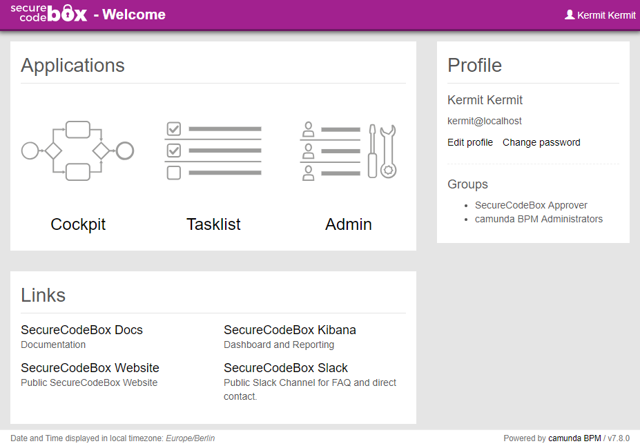

# Using the secureCodeBox

## Starting Scan-Processes using the Camunda UI

1. After logging in, the welcome screen will be displayed. From here you can start the different Camunda Web Apps.

* `Cockpit` is used for monitoring and operations on running and ended process instances.
* `Admin` is used for managing users, groups and authorizations.
* `Tasklist` is used for working on user tasks and starting processes.



2. Click on `Tasklist` to see a list of open tasks.


3. Next select `Start process` to open the list of available processes.


4. Choose the desired scan process to display the form for configuring the scan.


5. Finally, start the scan process by clicking `Start`.

> **Note**: A more detailed guide for the Camunda UI can be found [here][camundaWebApps].

[camundaWebApps]: https://docs.camunda.org/manual/7.8/webapps/


## Starting Scan-Processes using the REST-API

In order to start a scan via the REST-API, send a PUT-Request to the following URL:
`/box/processes/$PROCESS_KEY` with `$PROCESS_KEY` being the id defined in the respective BPMN file. As an example the URL for starting a nmap scan with SecureCodeBox running on localhost would be `http://localhost:8080/box/processes/nmap-process`.

Targets gets passed in a the payload.

```json
[
  {
    "name": "Local Test",
    "location": "localhost",
    "attributes": {
      "NMAP_PARAMETER": "-O"
    }
  }
]
```

You can check out a more detailed documentation in the Swagger Documentation of the secureCodeBox Engine. The Swagger Docs come together with the secureCodeBox Engine. You can access it at `http://localhost:8080/swagger-ui.html#/scan-process-resource` (you need to have the engine running on localhost).
